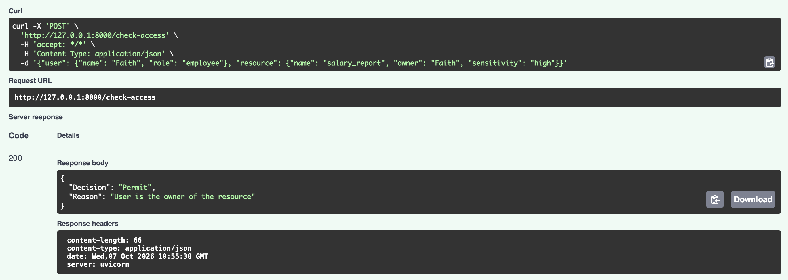
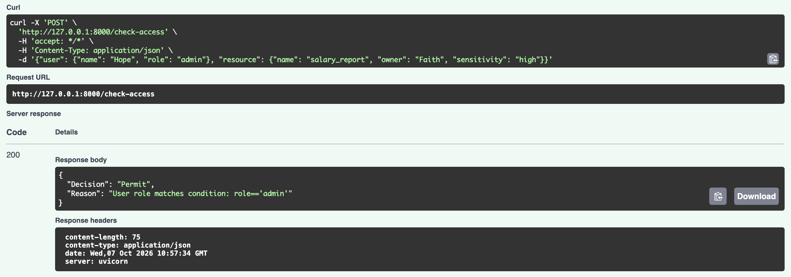
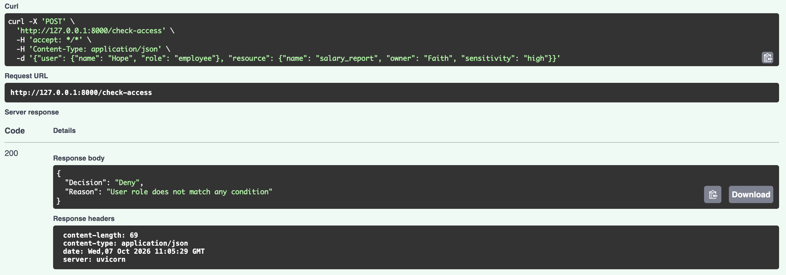

# Access Control API

A small rule-based access control (ABAC-style) engine built with FastAPI

## Motivation

I built this after working on a rule-based product cloning feature in my previous job as a Software Engineer — deciding what was allowed based on a set of conditions. I wanted to explore the same kind of problem through a security lens: who should be allowed to access a resource and why.

## Working

Access is granted only if the user is either the resource's owner or has the admin role. Users who own a different resource (not the one being requested) are correctly denied — only the actual owner of that specific resource is permitted.

## Example

### Payload 1 — Owner requesting their own resource

{"user": {"name": "Faith", "role": "employee"}, "resource": {"name": "salary_report", "owner": "Faith", "sensitivity": "high"}}

### Result 1 - Permit (owner)



### Payload 2 — Admin requesting any resource

{"user": {"name": "Hope", "role": "admin"}, "resource": {"name": "salary_report", "owner": "Faith", "sensitivity": "high"}}

### Result 2 - Permit (admin)



### Payload 3 — Neither admin nor owner

{"user": {"name": "Hope", "role": "employee"}, "resource": {"name": "salary_report", "owner": "Faith", "sensitivity": "high"}}

### Result 3 - Deny




## Features

- Role-based access rules
- Ownership-based access rules
- FastAPI REST endpoint
- Automatic interactive API docs (Swagger)

## Tech Stack

- Python
- FastAPI
- Uvicorn

## Installation

Clone the repository and install the dependencies:

```bash
python3 -m pip install fastapi uvicorn
```

## Run the Application

```bash
python3 -m uvicorn main:app --reload
```

Then open:

- API: `http://127.0.0.1:8000`
- Swagger docs: `http://127.0.0.1:8000/docs`

## Project Structure

```text
access_control/
├── main.py
├── README.md
└── requirements.txt
```

## Possible Extensions

- AND/OR logic for combining multiple conditions
- Persistent rule storage (e.g. a database instead of a hardcoded list)
- A simple frontend to add/edit rules and test requests